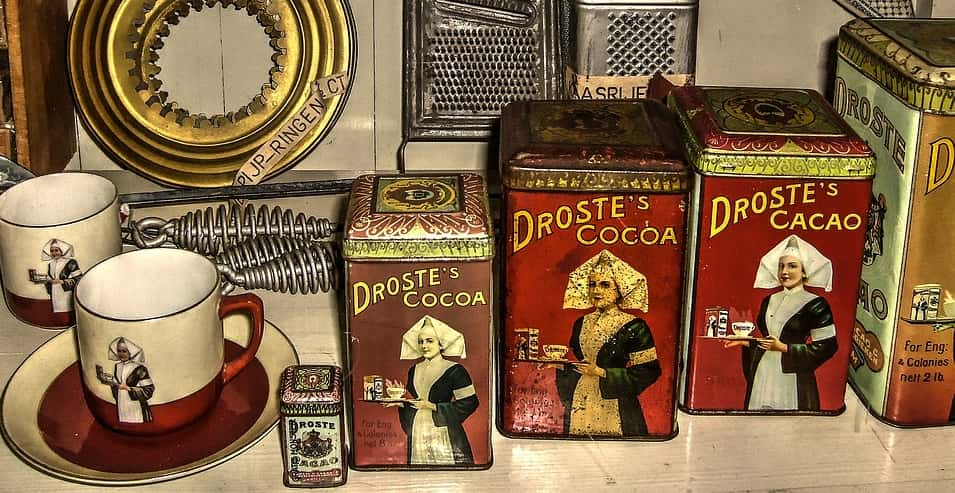

# Droste

Droste is a recursion library for Scala.

**SBT installation**

Select a tagged release version (`x.y.z`) and then add the following
to your SBT build:

```scala
libraryDependencies += "io.higherkindness" %% "droste-core" % "x.y.z"
```

# Usage

Droste makes it easy to assemble morphisms. For example, calculating
Fibonacci values can be done with a histomorphism if we model natural
numbers as a chain of `Option`. We can easily unfold with an
anamorphism and then fold to our result with a histomorphism.

```scala
import qq.droste._
import qq.droste.data._
import cats.implicits._

val natCoalgebra: Coalgebra[Option, BigDecimal] =
  Coalgebra(n => if (n > 0) Some(n - 1) else None)

val fibAlgebra: CVAlgebra[Option, BigDecimal] = CVAlgebra {
  case Some(r1 :< Some(r2 :< _)) => r1 + r2
  case Some(_ :< None)           => 1
  case None                      => 0
}

val fib: BigDecimal => BigDecimal = scheme.ghylo(
  fibAlgebra.gather(Gather.histo),
  natCoalgebra.scatter(Scatter.ana))
```

```scala
scala> fib(0)
res0: BigDecimal = 0

scala> fib(1)
res1: BigDecimal = 1

scala> fib(2)
res2: BigDecimal = 1

scala> fib(10)
res3: BigDecimal = 55

scala> fib(100)
res4: BigDecimal = 354224848179261915075
```

An anamorphism followed by a histomorphism is also known as a
dynamorphism. Recursion scheme animals like dyna are available
in the zoo:

```scala

val fibAlt: BigDecimal => BigDecimal =
  scheme.zoo.dyna(fibAlgebra, natCoalgebra)
```

```scala
scala> fibAlt(0)
res5: BigDecimal = 0

scala> fibAlt(1)
res6: BigDecimal = 1

scala> fibAlt(2)
res7: BigDecimal = 1

scala> fibAlt(10)
res8: BigDecimal = 55

scala> fibAlt(100)
res9: BigDecimal = 354224848179261915075
```

What if we want to do two things at once? Let's calculate a
Fibonacci value and the sum of all squares.

```scala
val fromNatAlgebra: Algebra[Option, BigDecimal] = Algebra {
  case Some(n) => n + 1
  case None    => 0
}

// note: n is the fromNatAlgebra helper value from the previous level of recursion
val sumSquaresAlgebra: RAlgebra[BigDecimal, Option, BigDecimal] = RAlgebra {
  case Some((n, value)) => value + (n + 1) * (n + 1)
  case None             => 0
}

val sumSquares: BigDecimal => BigDecimal = scheme.ghylo(
  sumSquaresAlgebra.gather(Gather.zygo(fromNatAlgebra)),
  natCoalgebra.scatter(Scatter.ana))
```

```scala
scala> sumSquares(0)
res11: BigDecimal = 0

scala> sumSquares(1)
res12: BigDecimal = 1

scala> sumSquares(2)
res13: BigDecimal = 5

scala> sumSquares(10)
res14: BigDecimal = 385

scala> sumSquares(100)
res15: BigDecimal = 338350
```

Now we can zip the two algebras into one so that we calculate
both results in one pass.

```scala
val fused: BigDecimal => (BigDecimal, BigDecimal) =
  scheme.ghylo(
    fibAlgebra.gather(Gather.histo) zip
    sumSquaresAlgebra.gather(Gather.zygo(fromNatAlgebra)),
    natCoalgebra.scatter(Scatter.ana))
```

```scala
scala> fused(0)
res16: (BigDecimal, BigDecimal) = (0,0)

scala> fused(1)
res17: (BigDecimal, BigDecimal) = (1,1)

scala> fused(2)
res18: (BigDecimal, BigDecimal) = (1,5)

scala> fused(10)
res19: (BigDecimal, BigDecimal) = (55,385)

scala> fused(100)
res20: (BigDecimal, BigDecimal) = (354224848179261915075,338350)
```

Droste includes [athema](athema), a math expression parser/processor,
as a more extensive example of recursion schemes.

# Credits

A substantial amount of Droste's code is a derivation-- or an
alternative encoding-- of patterns pioneered by others. Droste has
benefited from the excellent work in many other recursion libraries,
blog posts, academic papers, etc. Notably, Droste has benefited from:

- [recursion-schemes](https://github.com/ekmett/recursion-schemes)
- [Matryoshka](https://github.com/slamdata/matryoshka)

Thank you to everyone involved. Additionally, thanks to Greg Pfeil
(@sellout) for answering my random questions over the last few years
while I've been slowly learning (and using recursion) schemes.

# Copyright and License

Copyright the maintainers, 2018-present.

All code is available to you under the Apache License, Version 2.0,
available at http://www.apache.org/licenses/LICENSE-2.0.

# Disclamer

Please be advised that I have no idea what I am doing.
Nevertheless, this project is already being used for real
work with real data in real life.
